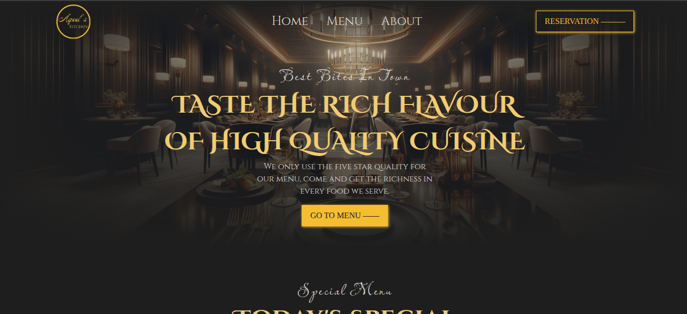
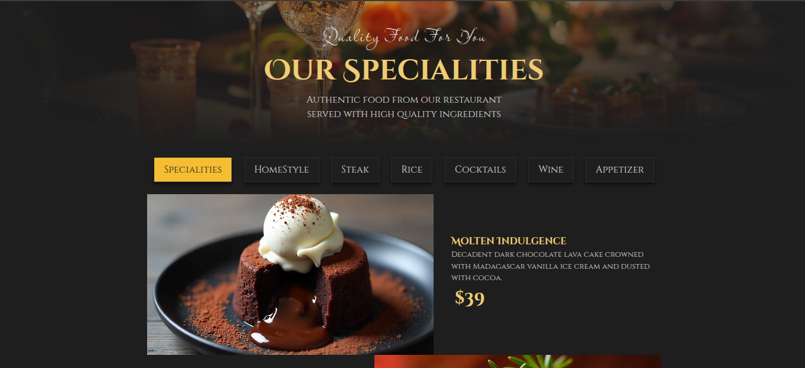
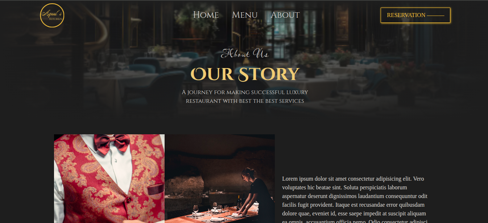

# LuxeBite – Luxury Restaurant Website

A modern luxury restaurant website built with **JavaScript, HTML, and CSS**, bundled using **Webpack**.  
The website is a single-page application (SPA) where content for each "page" (Home, Menu, About) is dynamically generated using JavaScript — no static HTML is hardcoded.

---

## ✨ Features
- Fully dynamic page rendering with JavaScript  
- Three main sections: Home, Menu, and About 
- Elegant and responsive design  
- Simple single-page navigation without reloading  
- Webpack for bundling and asset management  

---

## 🛠️ Tech Stack
- HTML  
- CSS  
- JavaScript (ES6+)  
- Webpack  

---

## 🚀 Getting Started

### 1. Clone the repository
```bash
git clone https://github.com/aqeel-sheikh/luxe-bite.git
````

### 2. Install dependencies

```bash
npm install
```

### 3. Run development server

```bash
npm run dev
```

### 4. Build for production

```bash
npm run build
```

---

## 📸 Preview

 
 
 

---

## 📜 License

This project is licensed under the MIT License.
